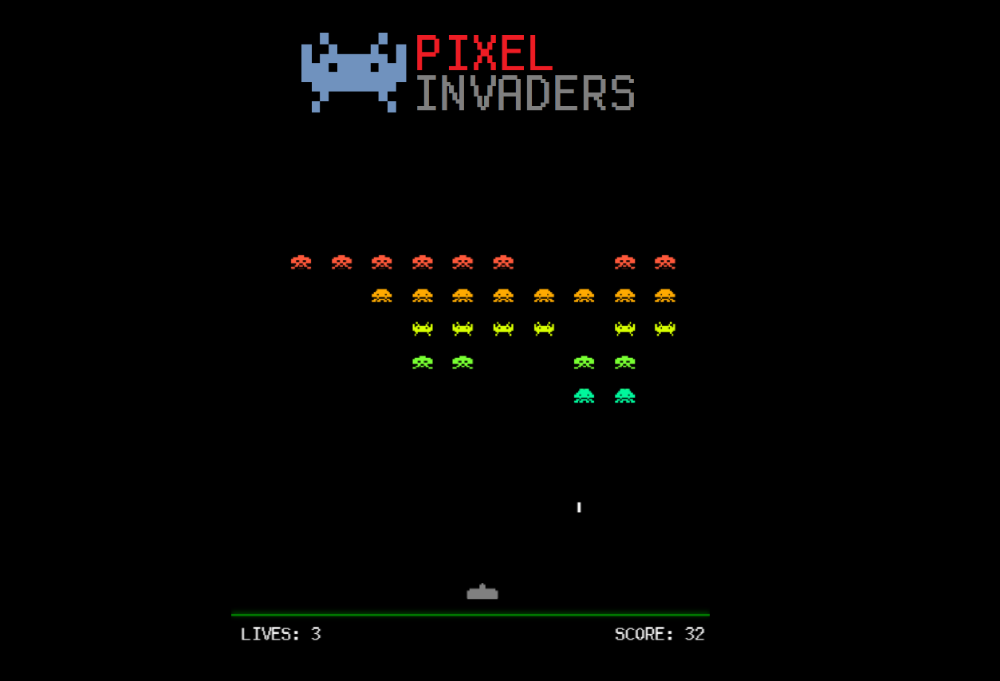

# Pixel Invaders

_Videojuego del clásico Space Invaders realizado en JavaScript_

## Link del proyecto 🚀

_[Pixel Invaders](https://pixelinvaders.netlify.app)_

## Instrucciones ⚙️

Tecla izquierda: Mover izquierda

Tecla derecha: Mover derecha

Tecla SPACE: Disparar

## Autor ✒️

**Luis Correa** - *Desarrollo del videojuego* - [GitHub](https://github.com/luisCorreaCespedes)

## Expresiones de Gratitud 🎁

* Si les gusta el proyecto pongan su ⭐️
* Mini juego hecho para todos los que toman café ☕ al programar. 
* Gracias a todos mis amigos por apoyarme a crear videojuegos aunque sean simples 🤓.

